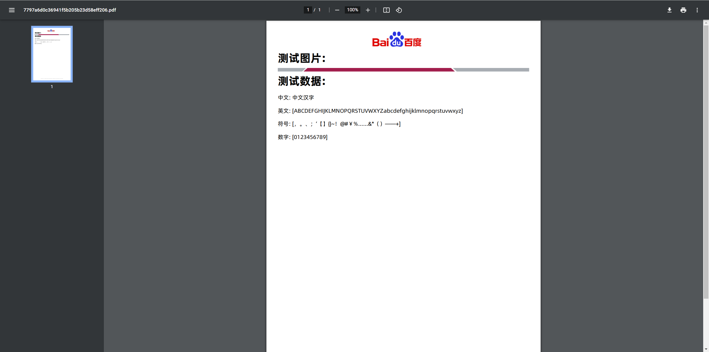
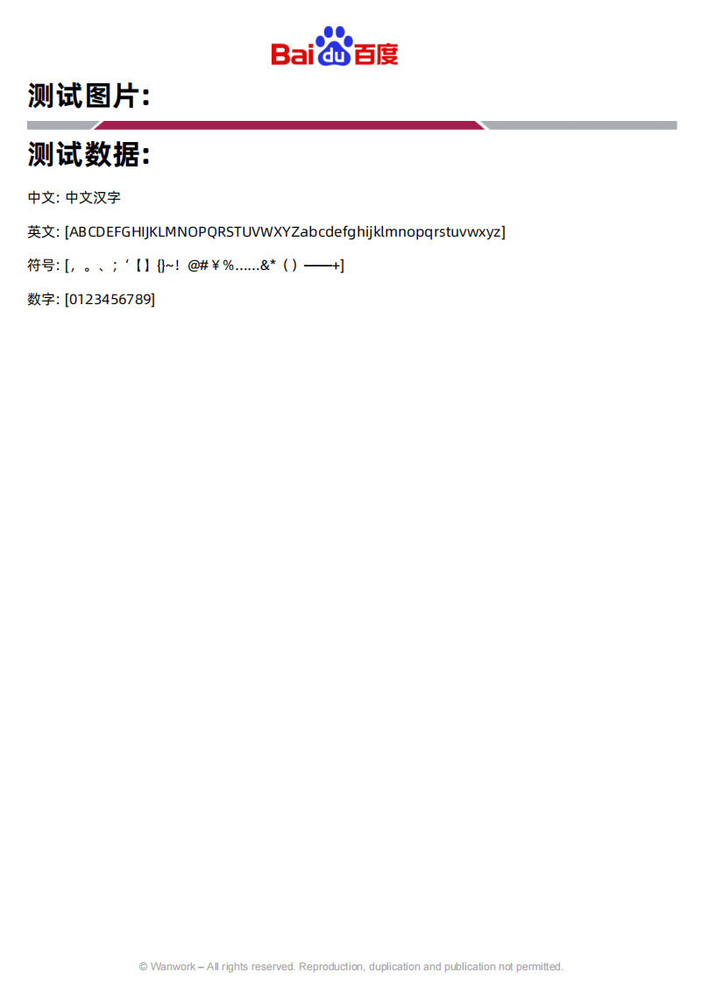

## PDF Generator

> 使用freemarker生成html, itextpdf7 对html进行pdf生成的一个简单示例

## 🐕 快速开始
##### 字体文件
> 🛡️ 在系统 ${user.home}/fonts 目录下放置字体文件 (源文件在代码fonts目录下)

##### 示例
[预览](http://localhost:10006/report/preview/one.ftl)
[导出](http://localhost:10006/report/export/one.ftl)

